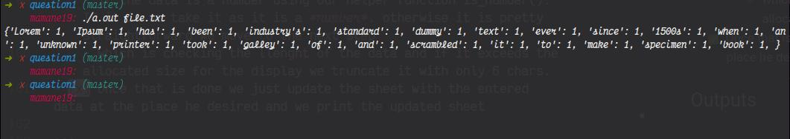

# Mid-Term Assignment Question1

Author: Mamane Bello <br>
email: b.moussaama@alustudent.com

---


## Get Started
To run the **program** type these commands one after another in your terminal inside the question1 directory
```bash
$ gcc question1.c
```
```bash
$ ./a.out <filename>
```
Feel free to change the content of the file.txt however you would like or create a new .txt file and add your own text. I did not provide a *MAX_LEN* or *MAX_WORDS*, but probably I should have.
Feel free to point it out if you think it should have been added :)

***

## Good to know

```c
printf("{");
for (int i = 0; i < num_words; i++)
{
     if (hashmap[i] == 1)
     {
          printf("'%s': %d, ", words[i], hashmap[i]);
          num_unique_words++;
     }
               
}
printf("}\n");
```
The above code snippet only prints the unique words as specified in the prompt. IF you want to print all the words and their number of occurences, in other words printing words that are not unique and have more than 1 occurence. Then you should consider changing this: *```if (hashmap[i] == 1)  ```* to   this: *```  if (hashmap[i] != 0)```*.
<br>
I did not really bother for this one cause the prompt especifically said unique words, that means those that occures only once.

***

## Known Issue

When printing the words, it prints all the words except the last one. I have tried all the possible alternatives to fix that but I couldn't get it through within the given time.

At first I thought it was the indexing of the hashmap, but I was wrong. I even added the index when traversing the hashmap to print the elements.

***
## Approach

As long as the approach is concerned I think the code is self-explanatory and the comments also help break through and understand what is going on.
But I am gonna list the key points here:

  - [x] We open the fie
  - [x] We read the file
  - [x] We init a hasmap in which we will store the words and their respective occurences.
  - [x] We count the words
  - [x] then we print the hashmap
  - [x] The whole process is forked and we do the above operations in the child process.
  - [x] The parent process waits for the child process to finish.

***
## Outputs
<p>

</p>

<br>

<h2 align="center"> And Voila! We are done!</h2>