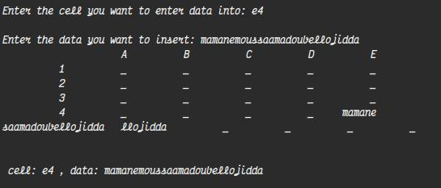
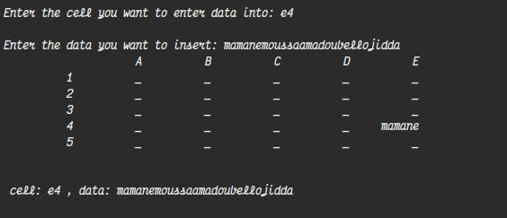
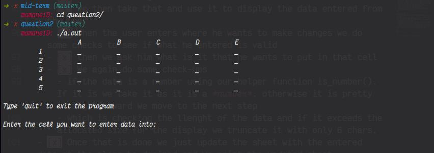
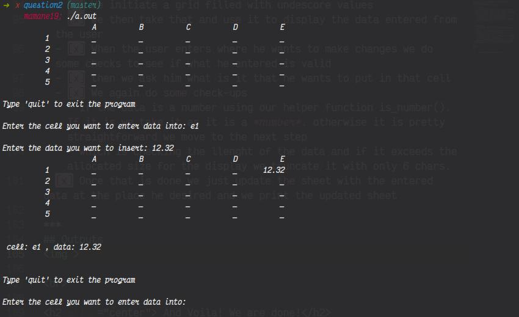
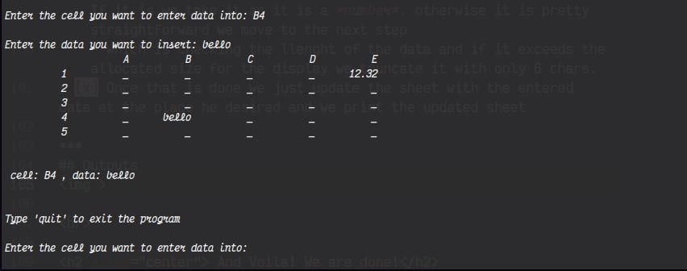
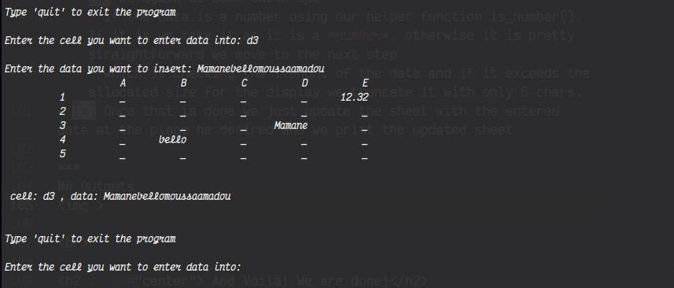
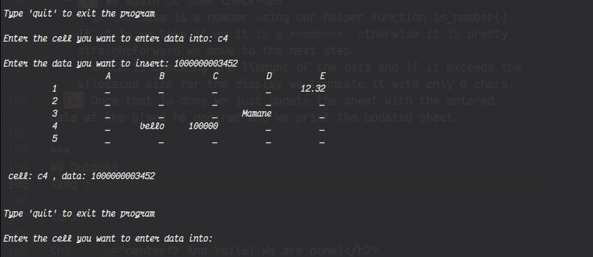
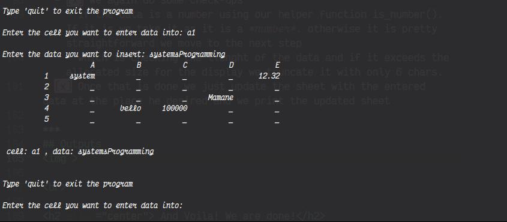

# Mid-Term Assignment question2

Author: Mamane Bello <br>
email: b.moussaama@alustudent.com

---

## Get Started
To run the **program** type these commands one after another in your terminal inside the question1 directory
```bash
$ gcc question2.c
```
```bash
$ ./a.out
```
If at any point wether the program asks you to enter the cell or the data you want to exit the program just type **``` quit```** instead typing what is asked.

***

## Good to know

The grid should be 5 by 5, yeah right you have probably seen I initiaded my array with this ``` char sheet[6][6][40]```.

**Explanation**
<br>
Well I am dealing with grids here and the [40] you see is the size of the array. So in order to be able to clearly display the grid without any impromptu data or mixed data (i will show an example of what it would look like), I decided to go with 6 so that my data when they are entered are not mixed.

<p align=left">
If you try to go with ```(*)[5]``` you will get something like this:
<p> </p>
which does not look good at all. Aeasthetic is super important :) that's why i wanted to avoid such ugliness table...
</p>
</br>

You might be wondering as well why size of 40 right!?
Yeah I got you.
The reason behind that is to handle large inputs from the user.
When I ask the user to insert the data they want to be displayed in the sheet, tentively you might want to put a long char (eg: moussaamadoubellodjidda...) which is gonna be truncated of course. But that does not mean if the size is small it will be clearly trauncated.

</br>
Let me show you what I mean:
I am truncating from the 6th character

```c
if (strlen(sheet[row][col]) > 6)
     sheet[row][col][6] = '\0';
```
if I have a size of *10* then this input
```bash
$ Enter data to be inserted: mamanemoussaamadoubellodjidda
```
will result in something like this:
<p>

</p>
which is not waht it is supposed to be doing right? 
SO to correct that you might want to increase the size of the array:
<br>
in this way:

```c
char sheet[6][6][40]
```
I set it as 40 because I do not want to come back and forth when it is not enough and all that.
So in this case our output will llook like this:
<p>

</p>
Pretty cool right!?
Yup so that's the reason you see all those sizes stuff going on.

<br>

**Note**: You will need to do that in both parts where the sheet appears, otherwise the compiler will not like that hence it will throw you some stones :)


***


## Approach

As long as the approach is concerned I think the code is self-explanatory and the comments also help break through and understand what is going on.
But I am gonna list the key points here:

**point d'entrée**
  - [x] We have three functions: 
    - is_number() that is a heper function to make the code clean. What it does is pretty simple: just as the name says it checks if the input is a number. As for why we need that it is because the prompt says that even if the user enters a number we need to take it into consideration and record it where indicated.
    - operations() that's where everything happens. From typing the cell to updating the sheet with the data entered.
    - main() which is the entry. But where especifically we also initiated our empty grid and we are using that as a parameter inside our operations() function.
  
  <br>

**basic algorithm**
  - [x] We initiate a grid filled with undescore values
  - [x] We then take that and use it to display the data entered from the user
  - [x] When the user enters where he wants to make changes we do some checks to see if what he entered is valid
  - [x] then we ask him what is it that he wants to put in that cell
  - [x] We again do some check-ups
    - if the data is a number using our helper function is_number(). If it is we take it as it is a *number*. otherwise it is pretty straightforward we move to the next step
    - which is checking the llenght of the data and if it exceeds the allocated size for the display we truncate it with only 6 chars.
- [x] Once that is done we just update the sheet with the entered data at the place he desired and we print the updated sheet

***
## Outputs
<p>


<br>


<br>


<br>


<br>


<br>


<br>

</p>


<br>

<h2 align="center"> And Voila! We are done!</h2>